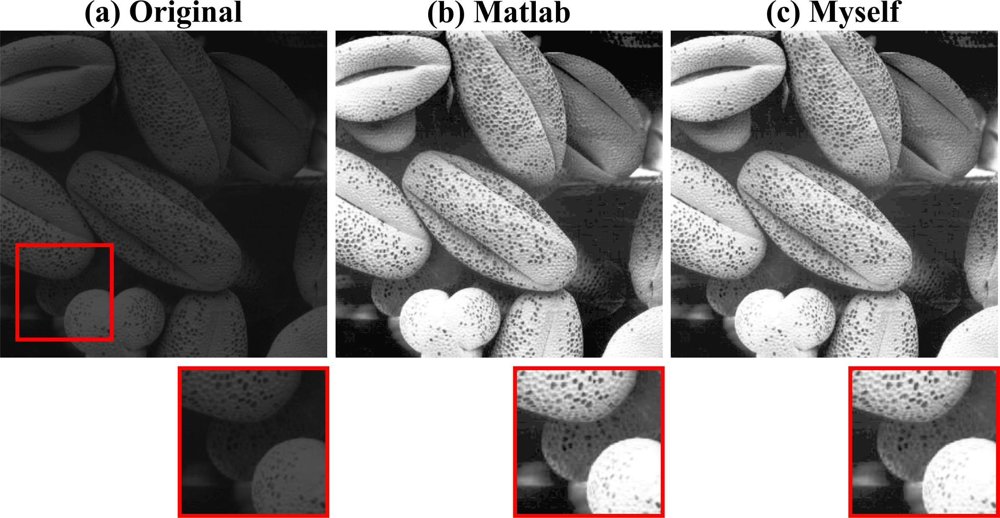
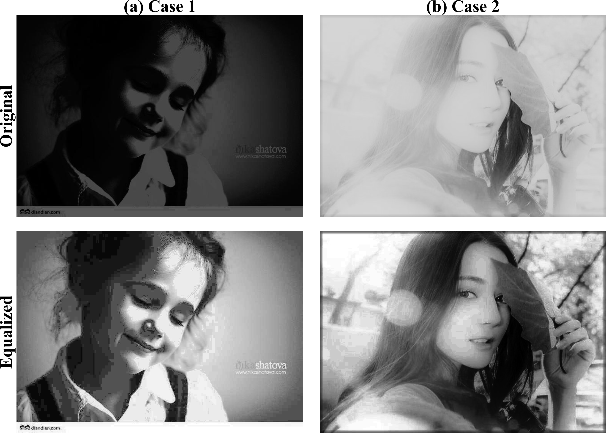
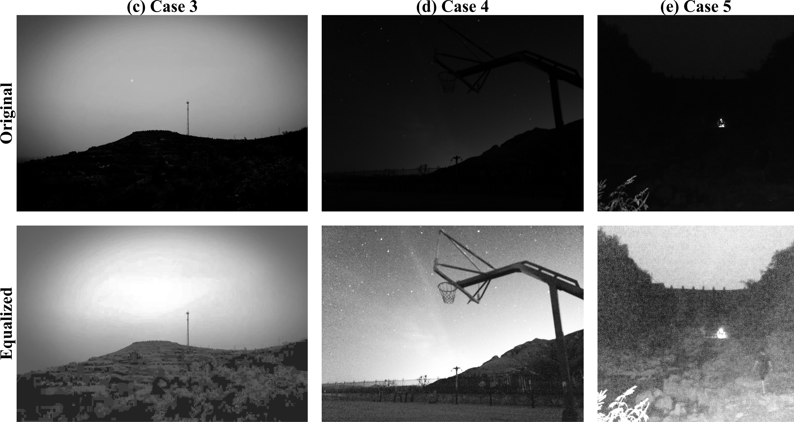

# Histogram Processing 
This folder contains of the algorithms for histogram processing of Digital Image Processing (DIP) course in my undergraduate period.

## Compared with Matlab
Fig. 1 shows the equalized results of a seed image. The compared code is 'histoequal' function in MATLAB 2018b. 
It can be seen that the code realized by myself has the comparable effectiveness with that in MATLAB.
The zoomed ROIs also demonstrates conclusion.

## Other results
Fig. 2 shows the processed results of two persons by using the  code realised by myself.
Fig. 3 shows the results of three natural landscape images.
It can be seen that by equalizing the histogram of the images, the visual sense is improved.

## Contact

If you have any question, please feel free to contact Danyang Li (Email: lidanyang1995@smu.edu.cn).